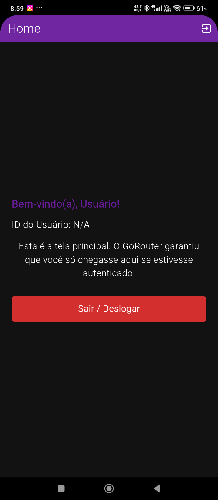
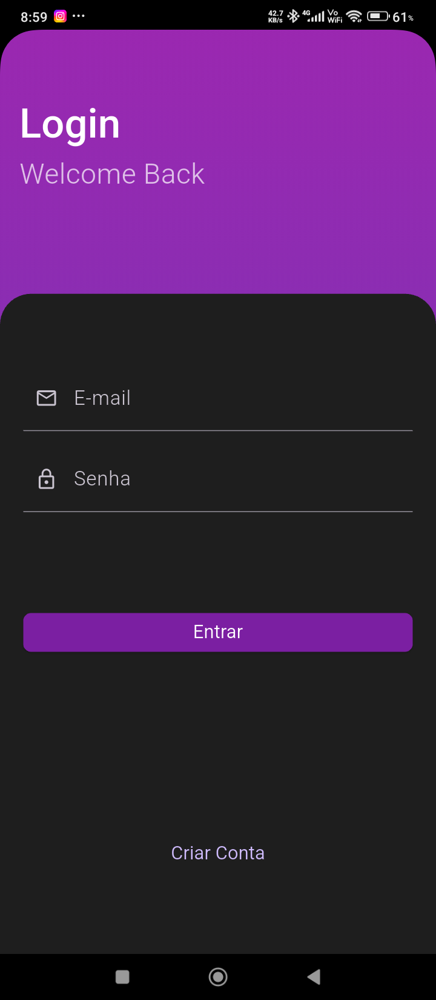

# 🔐 Auth - Firebase Authentication Flutter App

A modern and secure **Flutter authentication application** with Firebase integration, featuring Google Sign-In, email/password authentication, and user management.

---

## 🎯 About the Project

This project features a production-ready Flutter app that implements a full authentication system using Firebase. It demonstrates engineering best practices for authentication, state management using Riverpod, and secure data handling.

### 🌟 Key Features

- **Email & Password Authentication** – Secure user registration and login
- **Google Sign-In** – Authenticate with Google account
- **Firebase UI Auth** – Pre-built, production-ready authentication UI
- **State Management** – Using Riverpod
- **Navigation** – Go Router for type-safe routing
- **Cloud Firestore** – Real-time database support
- **Cross-platform** – Android, iOS, and Web support
- **Testing Ready** – Mocktail for unit/widget tests

---

## 🛠️ Tech Stack

### Frontend


### Backend & Services


### State Management & Routing
- **Riverpod** - Type-safe, reactive state management
- **Go Router** - Declarative routing with deep linking support

### Testing
- **Mocktail** - Mocking library for unit and widget tests
- **Flutter Test** - Flutter's built-in testing framework

---

## 📋 Main Dependencies

```yaml
# Firebase & Authentication
firebase_core: ^4.2.0          # Firebase initialization
firebase_auth: ^6.1.1          # Firebase Authentication
firebase_ui_auth: ^3.0.1       # Pre-built auth UI
google_sign_in:  ^7.2.0         # Google Sign-In integration

# State Management & Navigation
riverpod: ^3.0.3               # State management
flutter_riverpod: ^3.0.3       # Flutter Riverpod integration
go_router: ^16.3.0             # Navigation & routing

# Database
cloud_firestore: ^6.0.3        # Firestore real-time database

# Testing
mocktail: ^1.0.4               # Mocking for tests

# UI
cupertino_icons: ^1.0.8        # iOS-style icons
```

---

## 🚀 Getting Started

### Prerequisites

Before you begin, ensure you have: 
- Flutter SDK 3.9.2 or higher installed
- Dart 3.9.2 or higher
- Firebase CLI installed
- A Firebase project set up

### Installation

1. **Clone the repository**
   ```bash
   git clone https://github.com/emanoelsg/auth.git
   cd auth
   ```

2. **Install dependencies**
   ```bash
   flutter pub get
   ```

3. **Configure Firebase**
   ```bash
   # Login to Firebase CLI
   firebase login
   
   # Configure Firebase for your project
   flutterfire configure
   ```

4. **Run the app**
   ```bash
   flutter run
   ```

---

## 📂 Project Structure

```
lib/
├── main.dart                    # Entry point
├── app_router.dart              # Routing configuration
├── firebase_options.dart        # Firebase options (auto-generated)
├── auth/
│   ├── ui/
│   │   ├── pages/
│   │   │   ├── login_page.dart
│   │   │   ├── register_page.dart
│   │   │   ├── loading_page.dart
│   │   │   └── test_page.dart
│   │   └── controller/
│   │       ├── provider.dart    # Riverpod providers
│   │       ├── notifier.dart    # State notifier logic
│   │       └── state. dart       # Auth state definitions
│   ├── core/
│   │   ├── widgets/
│   │   │   ├── login_form.dart
│   │   │   └── register_form.dart
│   │   ├── const/
│   │   │   ├── colors.dart
│   │   │   └── sizes.dart
│   │   ├── utils/
│   │   │   └── validator.dart
│   │   └── theme/
│   │       └── theme.dart
│   ├── data/
│   │   └── repository_impl.dart # Firebase service implementation
│   └── domain/
│       ├── entities/
│       │   └── user_entity.dart
│       └── repositories/
│           └── repository. dart  # Abstract repository
└── test/
    ├── ui/
    │   └── controller/
    │       └── notifier_test.dart
    └── data/
        └── repository_impl_test.dart
```

---

## 🏗️ Architecture Overview

This project follows **Clean Architecture** principles with three layers:

### Domain Layer
- Defines abstract repository interfaces
- Contains business logic entities (`UserEntity`)
- Framework independent

### Data Layer
- Implements the abstract repository
- Handles Firebase API calls
- Manages data persistence with Firestore

### UI Layer
- Flutter widgets and screens
- Riverpod providers for state management
- Go Router for navigation

---

## 💡 Usage Examples

### Sign Up with Email & Password

```dart
final authNotifier = ref.read(authNotifierProvider. notifier);
await authNotifier.signUp(
  'John Doe',
  'john@example.com',
  'SecurePassword123!'
);
```

### Sign In with Email & Password

```dart
final authNotifier = ref.read(authNotifierProvider.notifier);
await authNotifier.signIn('john@example.com', 'SecurePassword123!');
```

### Listen to Authentication State

```dart
final authState = ref.watch(authNotifierProvider);

authState.when(
  data: (state) {
    if (state is AuthAuthenticated) {
      print('User logged in:  ${state.user.email}');
    } else if (state is AuthInitial) {
      print('User not logged in');
    }
  },
  loading: () => print('Loading...'),
  error: (error, stack) => print('Error: $error'),
);
```

### Access Current User

```dart
final authState = ref.watch(authNotifierProvider);

if (authState is AuthAuthenticated) {
  final user = authState.user;
  print('Email: ${user.email}');
  print('Name: ${user.name}');
}
```

### Sign Out

```dart
final authNotifier = ref.read(authNotifierProvider.notifier);
await authNotifier.signOut();
```

---

## 🧪 Testing

The project includes unit tests for the authentication flow using **Mocktail**. 

### Run Tests

```bash
flutter test
```

### Example Test:  Sign In

```dart
test('Sign in with valid email and password', () async {
  final mockRepository = MockAuthRepositoryImpl();
  final notifier = AuthNotifier(mockRepository);
  
  final testUser = UserEntity(
    id: '123',
    email: 'test@example.com',
    name: 'Test User',
  );
  
  when(() => mockRepository.signIn('test@example.com', 'password'))
    .thenAnswer((_) async => testUser);
  
  await notifier.signIn('test@example.com', 'password');
  
  expect(notifier.state, isA<AuthAuthenticated>());
});
```

---

## 🔒 Security Best Practices

✅ **Firebase Authentication** - Handles password hashing and encryption  
✅ **Firestore Security Rules** - Restrict database access at the backend  
✅ **No Hardcoded Credentials** - Use environment variables and `firebase_options. dart`  
✅ **Token Refresh** - Firebase automatically manages session tokens  
✅ **HTTPS Only** - All Firebase communications are encrypted  
✅ **Input Validation** - Email and password validation before submission  

### Example:  Firestore Security Rules

```firestore
rules_version = '2';
service cloud.firestore {
  match /databases/{database}/documents {
    // Users can only read/write their own data
    match /users/{userId} {
      allow read, write: if request.auth. uid == userId;
    }
  }
}
```

---

## 📸 Screenshots

### Login Screen


### Register Screen


---

## 🤝 Contributing

We welcome contributions! Here's how to get started:

1. **Fork the repository**
   ```bash
   git clone https://github.com/your-username/auth.git
   ```

2. **Create a feature branch**
   ```bash
   git checkout -b feature/AmazingFeature
   ```

3. **Commit your changes**
   ```bash
   git commit -m 'Add some AmazingFeature'
   ```

4. **Push to the branch**
   ```bash
   git push origin feature/AmazingFeature
   ```

5. **Open a Pull Request**
   - Provide a clear description of your changes
   - Link any related issues
   - Ensure all tests pass

### Code Style

- Follow Dart conventions
- Use meaningful variable names
- Add comments for complex logic
- Format code with `dart format`
- Lint with `flutter analyze`

---

## 📄 License

This project is licensed under the **MIT License** - see the LICENSE file for details. 

---

## 📞 Support & Contact

- 📧 **Email**: emanoeldasilvagomes16@gmail.com
- 🐙 **GitHub**: [@emanoelsg](https://github.com/emanoelsg)
- 💼 **LinkedIn**: [Emanoel Gomes](https://www.linkedin.com/in/emanoel-da-silva-gomes-280787306)
- 📱 **Instagram**: [@emanoeldsg](https://www.instagram.com/emanoeldsg/)

---

## 🙏 Acknowledgments

- [Firebase Documentation](https://firebase.google.com/docs)
- [Flutter Documentation](https://flutter.dev/docs)
- [Riverpod Documentation](https://riverpod.dev)
- [Go Router](https://pub.dev/packages/go_router)
- [Mocktail](https://pub.dev/packages/mocktail)

---

**⭐ If you found this project helpful, please give it a star! **  
**🐛 Found a bug?  [Open an issue! ](https://github.com/emanoelsg/auth/issues)**  
**💡 Have a suggestion? [Discussions are open!](https://github.com/emanoelsg/auth/discussions)**
